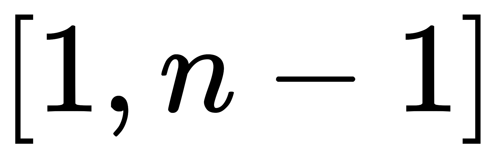
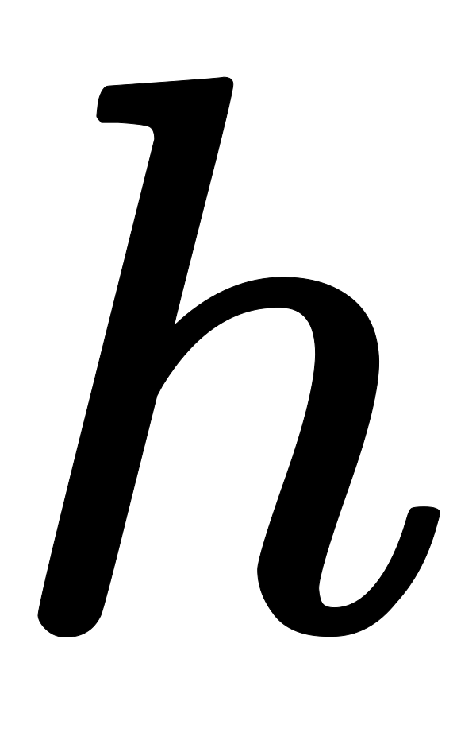
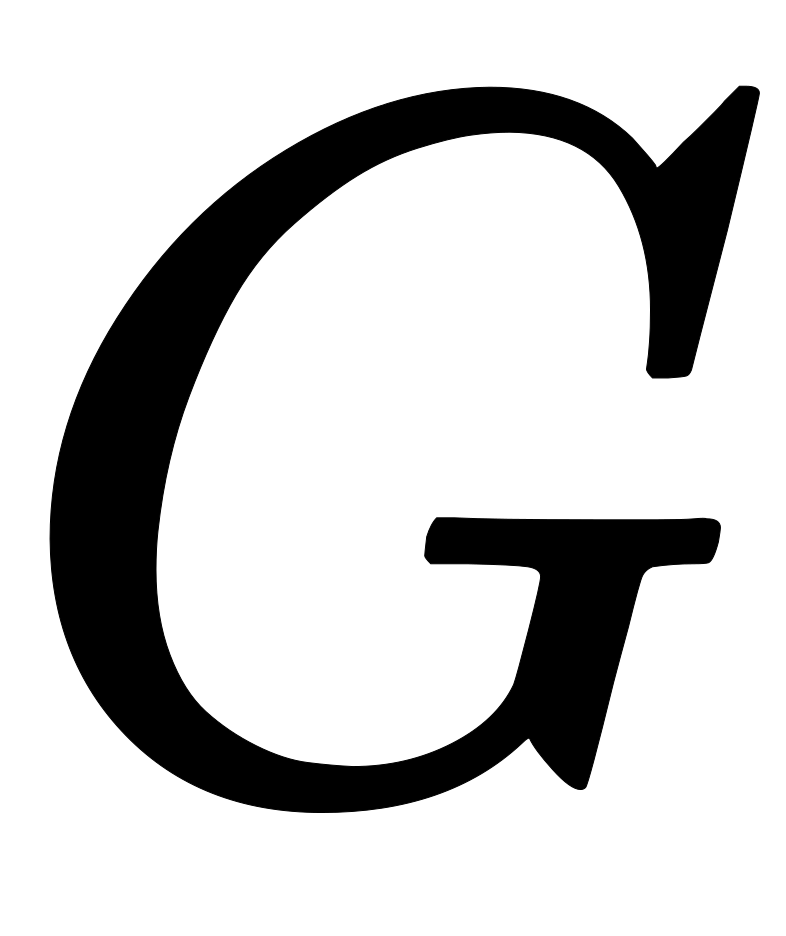

#### ECDSA算法测试

## 1. ECDSA算法流程

### 1.1 密钥对生成流程

#### **ECDSA密钥对生成流程详解**

在任何基于公钥密码学的体系中，一切的起点都是生成一对数学上相关联的密钥：一个私钥和一个公钥。在ECDSA中，这个过程既直接又高度依赖于密码学安全的随机性。

以下是生成ECDSA密钥对的详细步骤：

#### **第一步：选择椭圆曲线域参数**

与签名和验签一样，生成密钥对的第一步是确定要在哪个“数学场地”上进行运算。这需要选择一套标准的椭圆曲线域参数。这个选择至关重要，因为它定义了密钥的安全强度和兼容性。

常用的域参数标准包括：

- `secp256k1`: 因其高效的计算特性而被比特币和以太坊等主流加密货币采用。
- `secp256r1` **(或** `NIST P-256`**)**: 广泛应用于TLS/SSL等网络安全协议中。

选定的域参数将提供以下关键信息：

- **生成点（基点）** : 椭圆曲线上一个公开、固定的点。
- **阶** : 一个非常大的素数，决定了私钥的取值范围。

#### **第二步：生成私钥**

私钥是整个安全体系的核心，必须绝对保密。ECDSA的私钥本质上是一个非常大的随机数。

**生成过程：**
使用一个**密码学安全伪随机数生成器 (CSPRNG)** 来生成一个整数 。

这个整数  必须满足以下条件：

也就是说，私钥  是从1到  (包含边界) 范围内随机选取的一个数。这里的  是由所选域参数定义的阶。

**安全关键点：**

- **随机性**：必须使用高质量的随机源。如果私钥的生成过程是可预测的，那么攻击者就可能猜出或重现私钥，导致所有安全措施失效。
- **保密性**：生成的私钥  必须被妥善存储在安全的环境中，任何未经授权的访问都可能导致资金被盗或身份被冒用。

**私钥的本质**：它就是一个数字。例如，在 `secp256k1` 曲线中，它就是一个介于1和约  之间的整数。

#### **第三步：派生公钥**

公钥是由私钥通过椭圆曲线上的一个特定数学运算——**标量乘法（Scalar Multiplication）**——派生出来的。这个过程是单向的，意味着从私钥计算出公钥非常容易，但从公钥反推出私钥在计算上是不可行的。

**计算公式：**

这里的运算解释如下：

-  是要计算的公钥。
-  是上一步生成的私钥。
-  是所选域参数中的生成点。
- `×` 号并非普通的乘法，而是椭圆曲线上的“标量乘法”。它代表将点  与自身相加  次。例如， 就等于 。椭圆曲线上的加法有特定的几何定义。

**公钥的本质**：它不是一个数字，而是椭圆曲线上一个点的坐标 `(x, y)`。因此，公钥  由两个值组成。在实际应用中，公钥通常以压缩或非压缩格式存储和传输。

- **非压缩格式**: 直接存储点的 `(x, y)` 坐标，通常以一个固定的前缀（如 `04`）开头。
- **压缩格式**: 只存储 x 坐标和一个前缀（`02` 或 `03`）来表示 y 坐标的奇偶性。因为根据椭圆曲线方程，知道了 x 就可以计算出 y 的两个可能值（一个正一个负），前缀指明了是哪一个。这种格式可以节省存储空间。

#### **生成完毕**

经过这三个步骤，你就拥有了一对可用的ECDSA密钥：

- **私钥** : 一个保密的、随机的大整数。用于生成数字签名。
- **公钥** : 一个公开的、由私钥派生出的椭圆曲线上的点 `(x, y)`。用于验证数字签名。

任何人都可以用你的公钥  来验证由你的私钥  创建的签名，从而确认消息的来源和完整性，而你无需暴露你的私...

### 1.2 签名流程

**ECDSA签名流程详解**

椭圆曲线数字签名算法（Elliptic Curve Digital Signature Algorithm，简称ECDSA）是一种广泛应用于当今世界的数字签名技术，尤其在比特币和以太坊等加密货币领域扮演着核心角色。它利用椭圆曲线数学的复杂性，确保了数字信息的完整性、真实性和不可否认性。

ECDSA的签名流程本质上是利用私钥对消息摘要进行一系列数学运算，生成一个独一无二的数字签名。这个签名可以被持有对应公钥的任何人验证，从而确认消息确实是由该私钥的持有者签署的，并且在传输过程中未被篡改。

以下是ECDSA签名流程的详细步骤：

#### **第一步：准备工作——域参数和密钥对**

在进行签名之前，必须先确定一套椭圆曲线的“域参数”，这些参数定义了进行密码学运算的数学“场地”。这些参数通常是公开的、标准化的，例如比特币使用的`secp256k1`。

域参数主要包括：

- **椭圆曲线方程**: 定义了曲线的形状。
- **一个素数** : 定义了曲线所在的有限域的大小。
- **生成点（或基点）** : 椭圆曲线上一个固定的点，是所有计算的起点。
- **阶** : 一个大素数，代表点  在椭圆曲线上通过加法运算可以生成的点的总数。

此外，签名者必须拥有一对密钥：

- **私钥** : 一个随机选取的大整数，范围在  之间。这个密钥必须严格保密。
- **公钥** : 通过私钥和生成点  计算得出，即 。这是一个椭圆曲线上的点，可以公之于众。

#### **第二步：计算消息摘要**

直接对原始消息进行签名既不高效也不安全。因此，需要先使用一个安全的哈希算法（如SHA-256）对要签名的消息  进行处理，生成一个固定长度的哈希值（或称消息摘要） 。

这个摘要  将代表原始消息参与后续的签名运算。即使消息有微小的变动，其哈希值也会发生巨大变化，从而保证了签名的唯一性。

#### **第三步：生成临时密钥（随机数 k）**

这是ECDSA签名过程中至关重要且对安全性要求极高的一步。签名者需要生成一个密码学安全的随机整数 ，这个整数也必须在  的范围内。

**极其重要的一点是：**

-  **必须是保密的**。
- **每一次签名都必须使用一个全新的、不可预测的** 。如果同一个私钥在两次不同的签名中使用了相同的  值，攻击者将能够轻易地从这两个签名中反推出私钥，导致整个系统的崩溃。为了避免这个问题，现在通常采用确定性的方式（如RFC 6979）来生成 ，使其既能保证每次签名都不同，又能避免因随机数生成器不可靠而带来的安全风险。

#### **第四步：计算签名的 r 值**

利用上一步生成的随机数  和域参数中的生成点 ，计算出一个新的椭圆曲线上的点 。

然后，取这个点  的 x 坐标 ，并对阶  取模，得到签名的第一个部分 。

如果计算出的  值为0，则需要重新选择一个随机数  并重复此步骤。这种情况非常罕见。

#### **第五步：计算签名的 s 值**

接下来，利用消息摘要 、私钥 、随机数  和签名值 ，通过以下公式计算出签名的第二部分 ：

其中：

-  是  对阶  的模逆元，即满足  的整数。
-  是消息摘要。
-  是签名的第一个部分。
-  是签名者的私钥。

如果计算出的  值为0，也需要重新选择随机数  并重新计算。这种情况同样非常罕见。

#### **第六步：生成最终签名**

将计算出的  组合在一起，就构成了对消息  的最终数字签名。

这个签名随后可以和原始消息  以及签名者的公钥  一同发送给验证方。验证方将使用这三者来执行验证流程，以确认签名的有效性。

### 1.3 验签流程

**ECDSA验签流程详解**

签名验证是接收方确认数字签名有效性的过程。接收方利用发送方的公钥、原始消息和数字签名 `(r, s)` 来进行一系列计算，如果最终结果满足特定数学关系，则签名被确认为有效。这证明了消息确实是由对应的私钥持有者签署的，并且消息内容自签名后未被篡改。

以下是ECDSA验签流程的详细步骤：

#### **第一步：准备工作——获取必要信息**

在开始验证之前，验证者必须拥有以下三项信息：

1. **发送方的公钥** ：这是一个椭圆曲线上的点。
2. **原始消息** ：与签名时使用的消息完全相同。
3. **数字签名** ：由两个整数组成。

此外，验证者还必须知道签名时所使用的同一套椭圆曲线“域参数”（如 `secp256k1`），包括生成点  和阶 。

#### **第二步：检查签名的有效性**

首先，验证者需要对接收到的签名 `(r, s)` 进行初步检查，确保它们都在合法的范围内。`r` 和 `s` 的值都必须在 `[1, n-1]` 这个区间内。如果任一值为0或超出这个范围，验证会立即失败。

#### **第三步：计算消息摘要**

与签名过程一样，验证者需要使用**完全相同**的哈希算法（如SHA-256）来计算接收到的消息  的哈希值（消息摘要）。

如果消息在传输过程中有任何哪怕一比特的改动，计算出的  将与签名时使用的  完全不同，最终会导致验证失败。

#### **第四步：计算中间变量**

接下来，验证者使用签名 `(r, s)` 和消息摘要  来计算两个中间变量  和 。

首先，计算 `s` 对阶 `n` 的模逆元 。

然后，使用  和  计算  和 ：

#### **第五步：计算验证点**

这是整个验证过程的核心。验证者利用上一步计算出的  和 ，结合域参数中的生成点  和发送方的公钥 ，来计算一个椭圆曲线上的点 。

这个公式看起来很神奇，但它通过数学变换巧妙地将公钥、消息摘要和签名联系在了一起。如果签名是有效的，那么通过这个计算得到的点  应该就是签名过程中用临时密钥  生成的那个点 。

#### **第六步：最终验证**

最后一步，验证者检查上一步计算出的点  是否满足以下条件：

1. 首先，确保  不是无穷远点（椭圆曲线上的一个特殊点，相当于零元）。如果  是无穷远点，验证失败。
2. 然后，取点  的 x 坐标 ，对其进行模  运算，并与签名的  值进行比较。

**如果** **，则签名验证成功！**

**如果** **，则签名验证失败。**

#### **为什么这个过程有效？**

这个验证过程的数学原理可以简要推导如下：

根据第五步的公式：

将  和  的定义代入：

将  和公钥  代入：

提取公因式 ：

回顾签名过程第五步的公式 。我们可以推导出 。

因此，如果消息未被篡改 () 且签名有效，那么：

这正是签名第四步中计算出的点 。所以，点  的 x 坐标模  的结果自然应该等于签名中的 。整个验证过程通过反向计算，巧妙地验证了签名、公钥和消息之间的一致性，而无需知道核心机密——私钥  和临时密钥 。

## 2. ECDSA算法测试

### 2.1 测试算法列表
prime curves
- NID_X9_62_prime192v1,   // also known as NID_secp192r1
- NID_secp192k1
- NID_secp224r1
- NID_secp224k1
- NID_X9_62_prime256v1,   // also known as NID_secp256r1
- NID_secp256k1
- NID_secp384r1
- NID_secp521r1

**brainpool curves**
- NID_brainpoolP160r1
- NID_brainpoolP192r1
- NID_brainpoolP224r1
- NID_brainpoolP256r1
- NID_brainpoolP320r1
- NID_brainpoolP384r1
- NID_brainpoolP512r1

**sect curves**
- NID_sect163k1
- NID_sect163r2
- NID_sect193r1
- NID_sect193r2
- NID_sect233k1
- NID_sect233r1
- NID_sect239k1
- NID_sect283k1
- NID_sect283r1
- NID_sect409k1
- NID_sect409r1
- NID_sect571k1
- NID_sect571r1